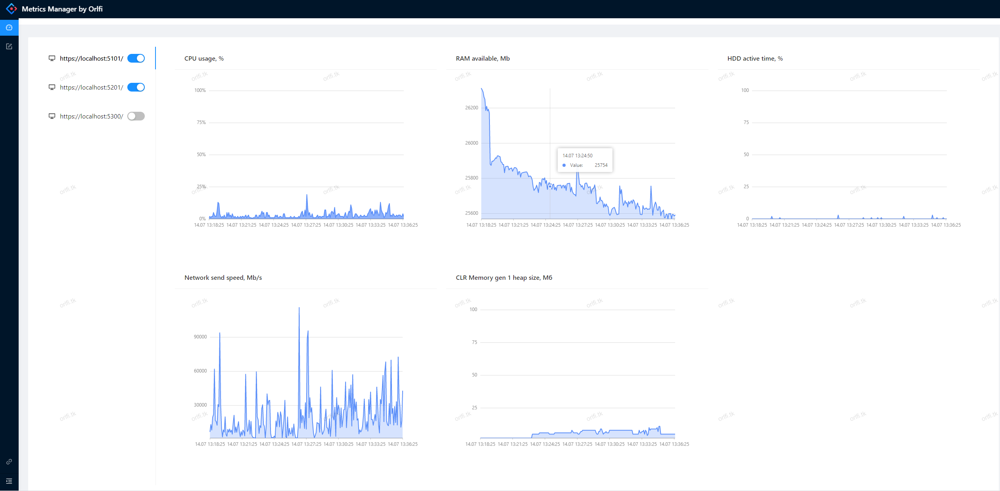
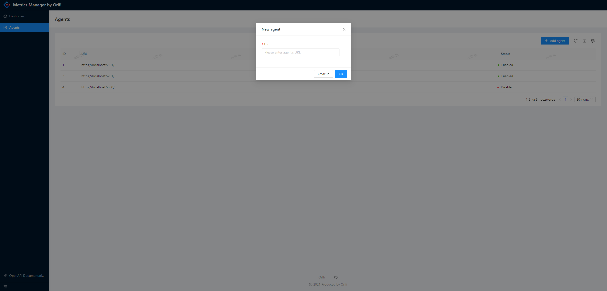

# Сервис сбора метрик

The application provides a service agent to engage in collecting system metrics, and a special service that represents the data obtained from the agent in the user-needed form. Client and server have APIs built in REST style. GUI is implemented as a SPA React application. 
Metrics Agent works only under Windows, Metrics Manager works under Windows and Linux.

[https://metrics.orlfi.tk](https://metrics.orlfi.tk)

## Features
* The service agent and the service manager collect once in 5 seconds and displays the following metrics:
  * **CPU metrics**
  * **DotNet metrics**
  * **Available RAM metrics**
  * **HDD usage metrics**
  * **Network metrics**

## Running and Building

* Build and run using the .NET SDK command line tools (`dotnet build`, `dotnet run` in the root directory of project. Run projects:
  * **Metrics Agent** `dotnet ./MetricsAgent/bin/Debug/net5.0/MetricsAgent.dll` or by directly executing `./MetricsAgent/bin/Debug/net5.0/MetricsAgent.exe`.
  * **Metrics Manager** `dotnet ./MetricsManager/bin/Debug/net5.0/MetricsAgent.dll` or by directly executing `./MetricsManager/bin/Debug/net5.0/MetricsAgent.exe`.

